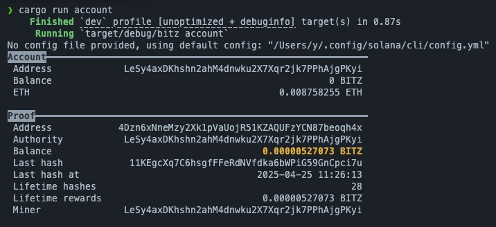

# bitz-rust
A BITZ tokens mining program. Based on https://github.com/naixiWeb3/bitz.

## Features

* Refactored the mining logic, replaced logic that can fail the whole command, like `unwrap()`, `expect()` by using `anyhow::Result`. In case there is errors, it can restart in it's own logic, no longer requiring to monitor the thread atoperating system level.
* fixed parameter in `Args`, now it loads correctly if you use config file `~/.config/solana/cli/config.yml`
* Pool mining is not implemented, as I didn't find a pool in which I can test.

## Background

[$BITZ](https://www.geckoterminal.com/eclipse/pools/CUzwQT8ZThYuKCerH3SpNu12eyxB4tAU3d19snjhELWU) runs on [Orca (Eclipse)](https://www.geckoterminal.com/eclipse/orca-eclipse/pools), while the native gas token is sometimes called **$ETH**, But in fact, Eclipse runs a modified Solana VM (SVM). which means in most cases, solana client works perferctly to interact with Eclipse blockchain.

